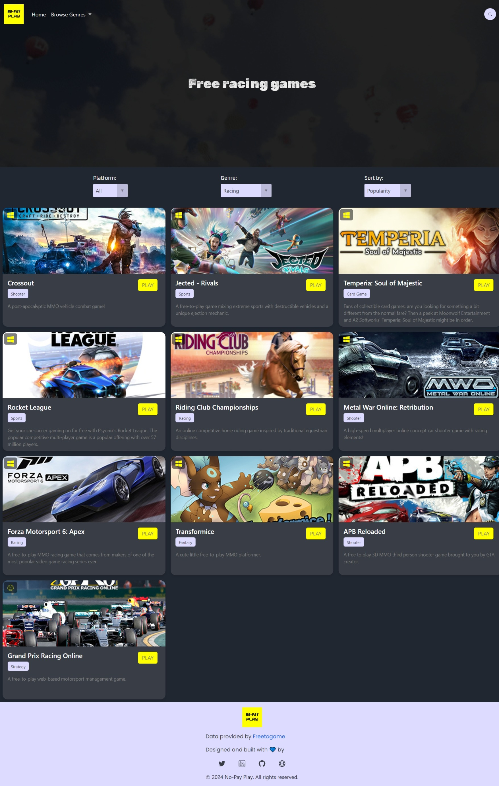

# No-Pay-Play 🎮

[](https://github.com/Joseph-kdev/No-Pay-Play/issues)
[](https://github.com/Joseph-kdev/No-Pay-Play/stargazers)
[](https://github.com/Joseph-kdev/No-Pay-Play/blob/main/LICENSE)

## [Live Preview](https://no-pay-play.onrender.com/)

## Description

No-Pay-Play is a curated collection of free-to-play games with a focus on helping gamers find engaging and budget-friendly options. Whether you're a casual gamer or a hardcore enthusiast, this platform is designed to give you the best no-pay gaming experience without compromising on quality.

## Screenshots




## Features

- 🎮 Discover a variety of free-to-play games.
- 📊 Comprehensive game descriptions, ratings, and tags.
- 🛠️ Easy-to-navigate UI with responsive design.
- 🔗 Direct links to download or play games.

## Technologies Used

- **Backend:** Python, Flask, Flask-SQLAlchemy
- **Frontend:** HTML, CSS, Bootstrap5, JavaScript
- **Database:** SQLite
- **Others:** Git, GitHub, Render (for deployment)

## Contributing

Contributions are welcome! Follow these steps to contribute to **No-Pay-Play**:

1. **Fork the repository.**

2. **Create a new branch:**

    ```bash
    git checkout -b feature/YourFeatureName
    ```

3. **Make your changes and commit them:**

    ```bash
    git commit -m "Add new feature"
    ```

4. **Push to the branch:**

    ```bash
    git push origin feature/YourFeatureName
    ```

5. **Open a Pull Request.**

## Acknowledgements

[FreeToGame](https://freetogame.com/) - Game Data provider for this project.
